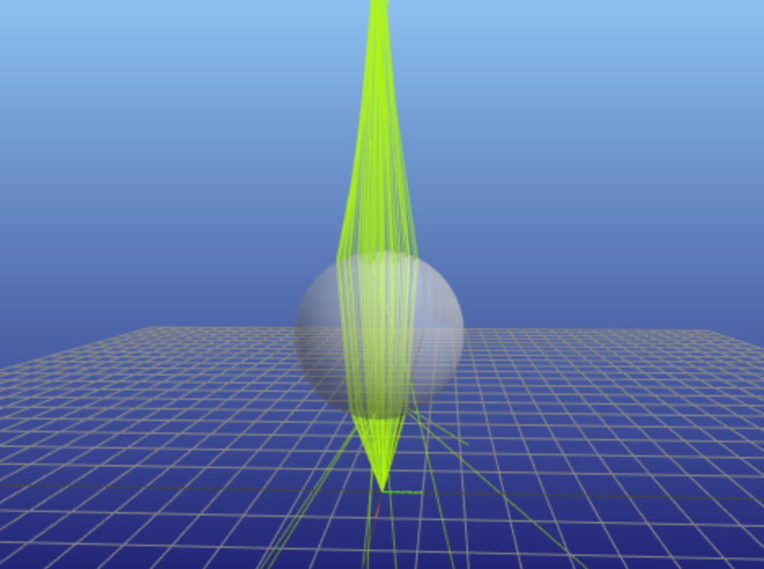

# pvtrace

> Ray-tracing for luminescent materials and spectral converter photovoltaic devices. 

## Introduction

pvtrace is a statistical photon path tracer written in Python. It follows photons through a 3D scene and records their interactions with objects to build up statistical information about energy flow. This approach is particularly useful in photovoltaics and non-imaging optics where the goal is to design systems which efficiently transport light to target locations.

pvtrace was originally written to characterise the performance of Luminescent Solar Concentrators (LSC) and takes a Monte-Carlo approach to ray-tracing. Each ray is independent and can interact with objects in the scene via reflection and refraction. Objects can have different optical properties: refractive index, absorption coefficient, emission spectrum and quantum yield.

One of the key features of pvtrace is the ability to simulate re-absorption of photons in luminescent materials. Moreover, pvtrace's architecture places emphasis on following individual photons as they interact with multiple luminescent absorbers. 

However, it may also be useful to researches or designers interesting in ray-optics simulations but will be slower at running these simulations compared to other software packages because pvtrace follows each ray individually.

    
A minimal working example that traces a glass sphere::

    # Add nodes to the scene graph
    world = Node(
        name="world (air)",
        geometry=Sphere(
            radius=10.0,
            material=Dielectric.air()
        )
    )
    sphere = Node(
        name="sphere (glass)",
        geometry=Sphere(
            radius=1.0,
            material=Dielectric.glass()
        ),
        parent=world
    )
    sphere.translate((0,0,2))

    # Add source of photons
    light = Node(
        name="Light (555nm)",
        light=Light(
            divergence_delegate=functools.partial(
                Light.cone_divergence, np.radians(20)
            )
        )
    )

    # Trace the scene
    scene = Scene(world)
    tracer = PhotonTracer(scene)
    for ray in light.emit(100):
        path = tracer.follow(ray)

Install
-------

Using pip::

    pip install pvtrace

or conda::

    conda install pvtrace

Examples
--------

The following documentation are Jupyter notebook tutorials converted to static HTML. I recommend that you install pvtrace and run these notebooks locally to get benefit of visualising the scene being ray traced.

Dependancies
------------

* python >= 3.7.2
* trimesh (for mesh shapes)
* meshcat (for visualisation)
* numpy
* anytree